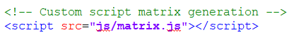

# Teaching-HEIGVD-RES-2018-Labo-HTTPInfra

## Objectifs

#### Objectif 1

Le premier objectif est de lancer un serveur apache httpd servant du contenu statique. Le tout est encapsulé dans un container docker.
La branche git est *fb-apache-static* et le Dockerfile est dans *docker_images*.

* Construire l'image docker:  

      docker build -t res/apache_php .

* Lancer un container à partir de cette image:

    docker run -d --name apache_static -p 9090:80 res/apache_php

* Joindre le serveur via l'URL représentée par la combinaison de l'IP du container docker et du port mappé:

      http://192.168.99.100:9090/

Le Dockerfile est composé de deux instructions:

- FROM php:7.0-apache
Cette instruction permet d'utiliser comme base de travail l'image officiel d'Apache pour construire notre serveur.

- COPY content/ /var/www/html/
Cette instruction permet de copier le framework bootstrap de site que nous avons choisi dans le container avant de le lancer.

Pour se connecter au container pendant qu'il tourne et faire des modifications, il est possible de lancer le mode interactif avec la commande suivante :

    docker exec -it apache_static /bin/bash

On peut alors aller dans le dossier content, là où se trouve toutes les configurations de notre site.

#### Objectif 2

Le second objectif consiste en le lancement d'un serveur *node* servant du contenu dynamique via le module *chance*. À chaque requête, nous récupérerons un payload JSon contenant une matrice générée aléatoirement.

* Branche git : *fb-express-dynamic*
* Image docker : *express-image*
* Construire l'image Docker: *docker build -t res/express_matrix .*
* Lancer l'image Docker:

1) Sans port mapping via Docker Machine

* Lancer l'image:

      docker run -d  --name express_dynamic res/express_matrix
* Récupérer l'adresse IP du container grâce à la commande:

      docker inspect express_dynamic | grep -i ipaddress

* Se connecter avec:

    telnet <adresse_container> 3000
* Envoyer des requêtes *GET* avec l'instruction:

    GET / HTTP/1.0

2) Avec port mapping

* Lancer l'image:

      docker run -d  --name express_dynamic -p 9090:3000 res/express_matrix

* Récupérer l'adresse IP du container grâce à la commande:

      docker inspect express_dynamic | grep -i ipaddress

* se connecter avec:

    telnet <adresse_vm_docker> 9090
 * Envoyer des requêtes *GET* avec l'instruction:

    GET / HTTP/1.0

Il est également possible de récupérer le fichier JSon via le navigateur ou avec l'application *Postman*.

Le contenu dynamique est généré via le script python *index.js* se trouvant dans src.

Le Dockerfile va prendre pour base la dernière image officielle de node, copier le contenu du dossier src dans le container et lancer index.js via node.

#### Objectif 3

* Branche git : *fb-express-dynamic*
* Image docker : *apache-reverse-proxy*

L'objectif ici est de mettre en place un reverse-proxy, comme point d'entrée unique, a qui on attribue un nom DNS. Ceci est essentiel pour des raisons de sécurité et dans le but de respecter la same-origin-policy. Cette politique spécifie qu'il est impossible d'accéder au contenu venant de notre serveur dynamique depuis notre page statique. Nous allons donc établir une connexion à notre reverse-proxy, qui lui-même va se charger de communiquer avec nos deux nœuds et faire la liaison entre le contenu retourné par ceux-ci.

Apache propose une configuration permettant de créer ce point d'entrée unique via les instructions contenues dans notre fichier de configuration.
On définit un ProxyPass pour nous rediriger vers notre contenu dynamique via l'IP de notre container express_dynamic et le port mappé lorsque que l'URL commence par la chaîne */api/matrix/*.

On définit également un ProxyPassReverse pour pouvoir écraser les informations renvoyées, remplacer les coordonnées du nœud par celles du reverse-proxy, et potentiellement modifier ces informations avant de les renvoyer à l'utilisateur.

Enfin, pour terminer, nous redéfinissons un second ProxyPass et un second ProxyPassReverse dans le cas où l'utilisateur entrerait autre chose que /api/matrix/ afin de nous rediriger vers une page indiquant une erreur.

Il y a donc un mapping vers nos containers, cependant cette configuration reste toutefois fragile car les IP de nos containers sont hard codée dans notre fichier de configuration. Il est donc nécessaire de démarrer nos containers dans le bon ordre pour que les adresses IP soient correctement attribuées. Les fichiers de configurations sont dans le dossier apache-reverse-proxy/conf/sites-available. La configuration de base s'appel 000-default.conf et celle de notre reverse-proxy s'appelle 001-reverse-proxy.conf .

Le Dockerfile de notre reverse-proxy se base sur une image officielle d'apache utilisant le php, va copier le fichier de configuration dans le container et ensuite lancer la configuration de notre reverse-proxy via VirtualHost, sur le port 80.

Pour lancer notre reverse-proxy, il faut exécuter les commandes dans l'ordre suivant:
  - Construire l'image docker res/apache_php comme présenté au premier objectif.
  - Lancer l'image res/apache_php sans port mapping avec la commande suivante:

        docker run -d --name apache_static res/apache_php
  - Construire et lancer l'image docker res/express_matrix comme présenté au second objectif (sans port mapping)
  - Construire et lancer l'image docker res/apache_rp avec les commandes suivantes:

Construire l'image:

    docker build -t res/apache_rp .

Puis exécuter l'image:

    docker run -d --name apache_rp -p 8080:80 res/apache_rp

Il est alors possible de se connecter:
  - À la page statique via l'URL:

  http://demo.res.ch:8080/

  - À la page dynamique via l'URL:

  http://demo.res.ch:8080/api/matrix/

#### Objectif 4
 Le reverse-proxy nous permet d'envoyer des requêtes Ajax. Ces requêtes vont nous permettre de modifier le contenu de notre page statique avant de la renvoyer à l'utilisateur. Pour ceci, nous avons dû:

 - Ajouter à *index.html* de notre page statique la ligne:

 - Créer le script python matrix.js présent dans le dossier js de notre page statique afin d'appeler à intervalle régulier notre page dynamique afin de générer du nouveau contenu, récupérer le contenu dans une variable et utiliser les requêtes Ajax afin de modifier notre page statique.
La modification se fait sur toutes les entités de la classe *container* et ce, grâce à la ligne suivante de matrix.js:

    $(".container").text(matrix);

Sans le reverse-proxy, la same-orgin-policy serait violée car nous ne pouvons pas afficher du contenu d'une origine A depuis une origine B (contenu dynamique dans notre page statique). Notre serveur dynamique et notre serveur statique sont deux entités à part, démarrées dans deux containers différents. Ils n'ont donc pas la même origine.
#### Objectif 5
Dans cette dernière partie, nous allons modifier la structure de notre reverse-proxy afin de pouvoir attribuer les adresses IP et les ports de nos containers statique et dynamique directement à l'exécution de notre reverse. Ceci nous permettra de pouvoir démarrer autant de container souhaité, dans l'ordre désiré et de démarrer notre reverse-proxy avec les containers voulu.
Pour cela, nous sommes passé par

- Construire et lancer l'image docker res/apache_php comme présenté au premier objectif.
- Construire et lancer l'image docker res/express_matrix comme présenté au second objectif (sans port mapping)
- Construire et lancer l'image docker res/apache_rp avec les commandes suivantes:

Récupérer l'adresse IP d'un container statique et d'un container dynamique avec:

    docker inspect container_name  | grep -i ipaddr

Construire l'image:

    docker build -t res/apache_rp .

Puis exécuter l'image:

    docker run -d -e STATIC_APP=IPContStatique:80 -e DYNAMIC_APP = IPContDynamique:3000 -–name apache_rp -p 8080:80 res/apache_rp

Dans le cas du lancement de plusieurs containers venant de la même image, s'assurer de leur attribuer des noms différents lors de l'exécution.

#### Objectif 6
Pour le Management UI, nous avons décidé d'utiliser l'application Portainer. C'est un excellent outil capable de réaliser toutes les opérations désirées sur nos images et container. Pour utiliser cette dernière, il suffit de lancer nos containers, puis de rentrer les deux commandes suivantes dans Docker:

    docker volume create portainer_data

    docker run -d -p 9000:9000 -v /var/run/docker.sock:/var/run/docker.sock -v portainer_data:/data portainer/portainer

  Il est alors possible de se connecter à l'application en se connectant à l'URL de notre serveur, mais cette fois via le port 9000.
